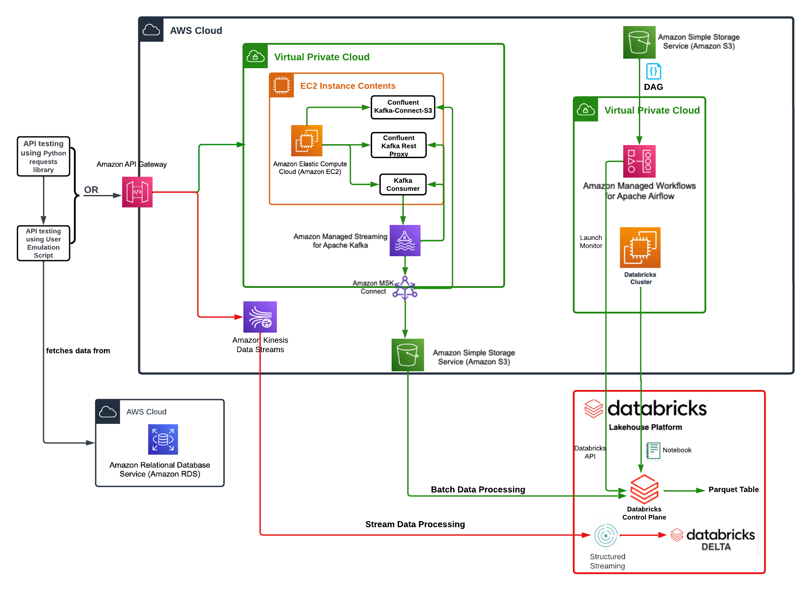
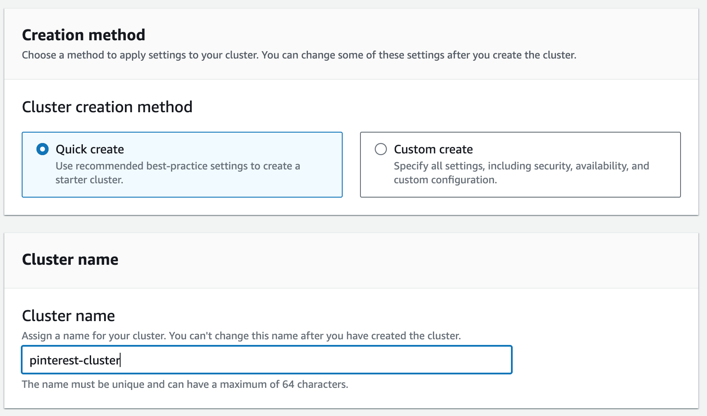
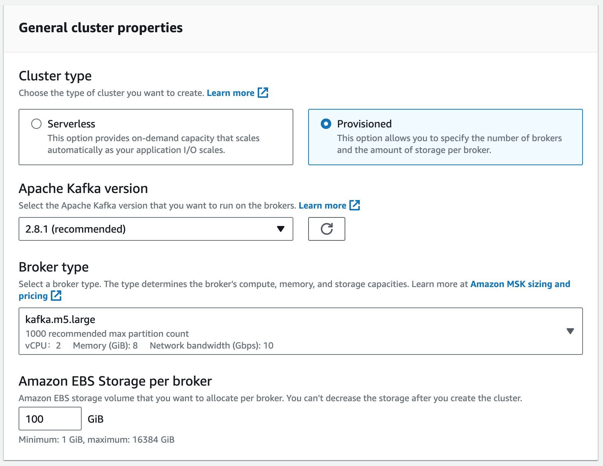
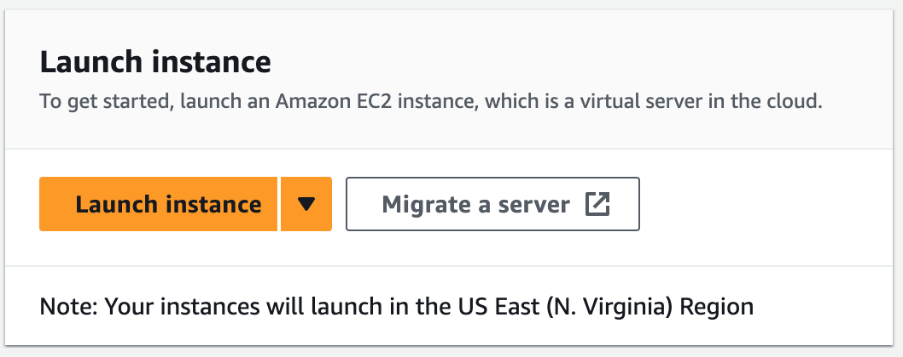
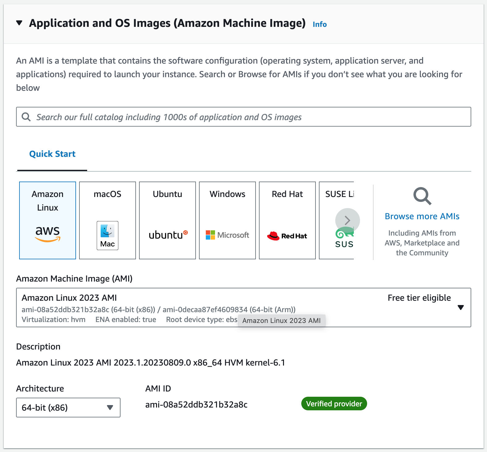
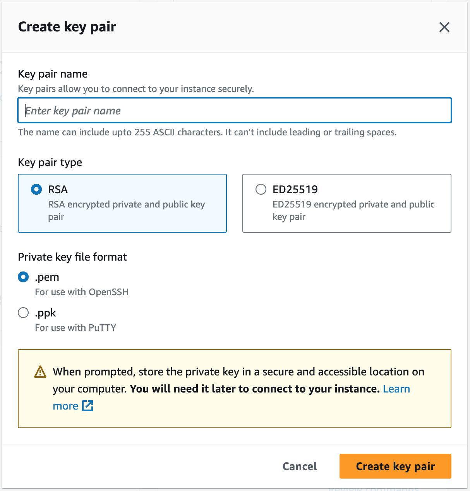
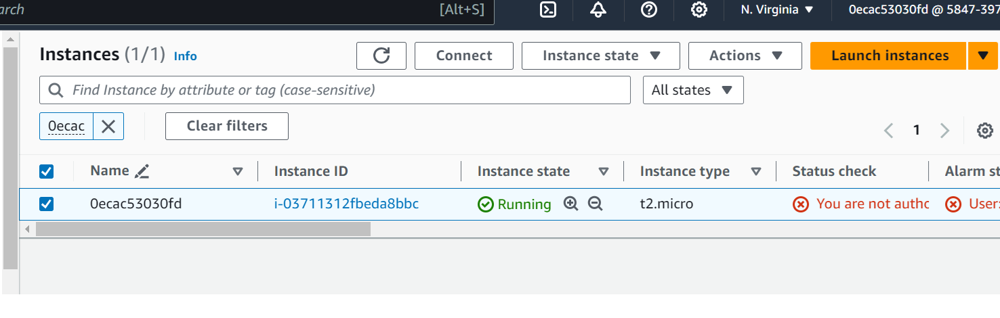
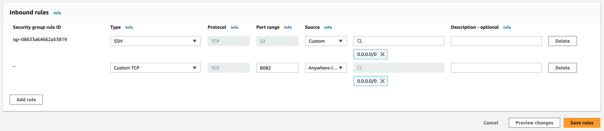
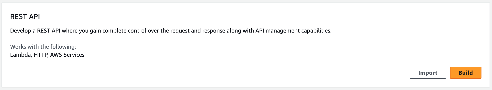
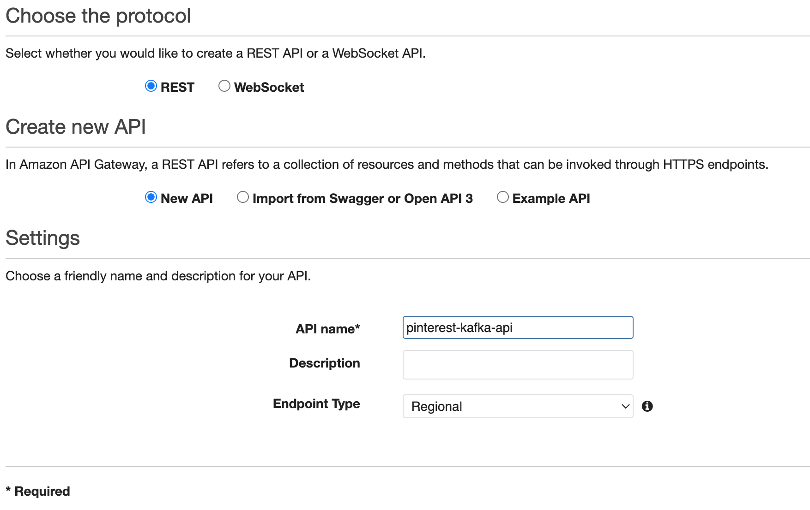

# pinterest-data-pipeline841

## Table of contents

- [Project Description](#project-description)
- [Project Installation and Dependencies](#project-installation-and-dependencies)
- [The Data](#the-data)
- [Tools used](#tools-used)
- [Architecture Overview](#architecture-overview)
- [Building the pipeline](#building-the-pipeline)
  - [Create an Apache cluster using AWS MSK](#create-an-apache-cluster-using-aws-msk)
  - [Create a client machine for the cluster](#create-a-client-machine-for-the-cluster)
  - [Enable client machine to connect to the cluster](#enable-client-machine-to-connect-to-the-cluster)
  - [Install Kafka on the client machine](#install-kafka-on-the-client-machine)
  - [Create topics on the Kafka cluster](#create-topics-on-the-kafka-cluster)
  - [Delivering messages to the Kafka cluster](#delivering-messages-to-the-kafka-cluster)
  - [AWS API Gateway](#aws-api-gateway)
  - [Sending messages to the cluster using the API gateway](#sending-messages-to-the-cluster-using-the-api-gateway)
  - [Connecting the Apache cluster to AWS S3 bucket](#connecting-the-apache-cluster-to-aws-s3-bucket)
- [Batch processing data using Apache Spark on Databricks](#batch-processing-data-using-apache-spark-on-databricks)
  - [Clean data using Apache Spark on Databricks](#clean-data-using-apache-spark-on-databricks)
  - [Querying the data using Apache Spark on Databricks](#querying-the-data-using-apache-spark-on-databricks)
  - [Orchestrating automated workflow of notebook on Databricks](#orchestrating-automated-workflow-of-notebook-on-databricks)
- [Processing streaming data](#processing-streaming-data)
  - [Create data streams on Kinesis](#create-data-streams-on-kinesis)
  - [Create API proxy for uploading data to streams](#create-api-proxy-for-uploading-data-to-streams)
  - [Sending data to the Kinesis streams](#sending-data-to-the-kinesis-streams)
  - [Processing the streaming data in Databricks](#processing-the-streaming-data-in-databricks)
- [Next steps](#next-steps)


## Project Description

This project emulates a Pinterest-like data pipeline to handle both batch and real-time user-generated data. The aim is to simulate the process of ingesting, processing, and storing data at scale, using AWS services. The project involves building two pipelines:

I. Batch Data Metrics with Kafka: This pipeline processes batch data using Kafka for computing metrics that depend on historical data. For example, it calculates metrics such as the most popular category over time. Kafka facilitates the ingestion and processing of batch data in a fault-tolerant and scalable manner, enabling historical analysis and insights.

II. Real-time Metrics with Kinesis: This pipeline computes real-time metrics, such as profile popularity, leveraging Kinesis for streaming data ingestion and processing. It enables efficient handling of real-time user interactions and allows for immediate insights into user behavior.

Through this project, I gained insights into managing data pipelines in a cloud environment, understanding the nuances of both streaming and batch processing technologies. I learned the importance of optimizing resource allocation and adjusting costs in the cloud architecture design. The architecture was crafted with scalability and fault tolerance in mind, employing data stream partitioning and optimized resource allocation to ensure efficient data flow and processing across both pipelines. This approach enabled the system to handle varying data volumes effectively, while minimizing costs and maximizing performance.


## Project Installation and Dependencies

The modules need to be installed:

- `python-dotenv`
- `sqlalchemy`
- `requests`

For the Virtual environment; CONDA environment is used 

- Create a Conda environment 
`conda create -n pinterest_project_env python=3.x`
`conda activate pinterest_project_env`
`pip install -r requirements.txt`


## The Data

To emulate the kind of data that Pinterest's engineers are likely to work with, this project contains a script, [user_posting_emulation.py] that when run from the terminal mimics the stream of random data points received by the Pinterest API when POST requests are made by users uploading data to Pinterest.

Running the script instantiates a database connector class, which is used to connect to an AWS RDS database containing the following tables:

- `pinterest_data` contains data about posts being updated to Pinterest
- `geolocation_data` contains data about the geolocation of each Pinterest post found in pinterest_data
- `user_data` contains data about the user that has uploaded each post found in pinterest_data
  
The `run_infinite_post_data_loop()` method infinitely iterates at random intervals between 0 and 2 seconds, selecting all columns of a random row from each of the three tables and writing the data to a dictionary. The three dictionaries are then printed to the console.

Examples of the data generated look like the following:

Examples of the data generated look like the following:

pinterest_data:
```
{
  "index": 5730,
  "unique_id": "1e1f0c8b-9fcf-460b-9154-c775827206eb",
  "title": "Island Oasis Coupon Organizer",
  "description": "Description Coupon Organizer in a fun colorful fabric -island oasis, Great Size for the 'basic' couponer - holds up to 500 coupons with ease, and is made long enough so that you…",
  "poster_name": "Consuelo Aguirre",
  "follower_count": "0",
  "tag_list": "Grocery Items,Grocery Coupons,Care Organization,Coupon Organization,Extreme Couponing,Couponing 101,Life Binder,Save My Money,Love Coupons",
  "is_image_or_video": "image",
  "image_src": "https://i.pinimg.com/originals/65/bb/ea/65bbeaf458907bb079317d8303c4fa0e.jpg",
  "downloaded": 1,
  "save_location": "Local save in /data/finance",
  "category": "finance"
}
```

geolocation_data:
```
{'ind': 5730, 'timestamp': datetime.datetime(2021, 4, 19, 17, 37, 3), 'latitude': -77.015, 'longitude': -101.437, 'country': 'Colombia'}
```

user_data:
```
{'ind': 5730, 'first_name': 'Rachel', 'last_name': 'Davis', 'age': 36, 'date_joined': datetime.datetime(2015, 12, 8, 20, 2, 43)}
```


## Tools used

- [Apache Kafka](https://kafka.apache.org/) - Apache Kafka is an event streaming platform. From the Kafka [documentation](https://kafka.apache.org/documentation/):
>Event streaming is the practice of capturing data in real-time from event sources like databases, sensors, mobile devices, cloud services, and software applications in the form of streams of events; storing these event streams durably for later retrieval; manipulating, processing, and reacting to the event streams in real-time as well as retrospectively; and routing the event streams to different destination technologies as needed. Event streaming thus ensures a continuous flow and interpretation of data so that the right information is at the right place, at the right time.

- [AWS MSK](https://aws.amazon.com/msk/) - Amazon Managed Streaming for Apache Kafka (Amazon MSK) is a fully managed service that enables you to build and run applications that use Apache Kafka to process streaming data. More information can be found in the [developer guide](https://docs.aws.amazon.com/msk/latest/developerguide/what-is-msk.html).

- [AWS MSK Connect](https://docs.aws.amazon.com/msk/latest/developerguide/msk-connect.html) - MSK Connect is a feature of Amazon MSK that makes it easy for developers to stream data to and from their Apache Kafka clusters. From the developer guide:
>With MSK Connect, you can deploy fully managed connectors built for Kafka Connect that move data into or pull data from popular data stores like Amazon S3... Use source connectors to import data from external systems into your topics. With sink connectors, you can export data from your topics to external systems.

- [Kafka REST Proxy](https://docs.confluent.io/platform/current/kafka-rest/index.html) - From the docs:
>The Confluent REST Proxy provides a RESTful interface to an Apache Kafka® cluster, making it easy to produce and consume messages, view the state of the cluster, and perform administrative actions without using the native Kafka protocol or clients.

- [AWS API Gateway](https://aws.amazon.com/api-gateway/) -
>Amazon API Gateway is a fully managed service that makes it easy for developers to create, publish, maintain, monitor, and secure APIs at any scale. APIs act as the "front door" for applications to access data, business logic, or functionality from your backend services.

- [Apache Spark](https://spark.apache.org/docs/3.4.1/) - Apache Spark™ is a multi-language engine for executing data engineering, data science, and machine learning on single-node machines or clusters. From the docs:
>Spark provides high-level APIs in Java, Scala, Python, and R, and an optimized engine that supports general execution graphs. It also supports a rich set of higher-level tools including Spark SQL for SQL and structured data processing, pandas API on Spark for pandas workloads, MLlib for machine learning, GraphX for graph processing, and Structured Streaming for incremental computation and stream processing.

- [PySpark](https://spark.apache.org/docs/3.4.1/api/python/index.html) - PySpark is the Python API for Apache Spark.
>It enables you to perform real-time, large-scale data processing in a distributed environment using Python. It also provides a PySpark shell for interactively analyzing your data. PySpark combines Python’s learnability and ease of use with the power of Apache Spark to enable processing and analysis of data at any size for everyone familiar with Python.

- [Databricks](https://docs.databricks.com/en/index.html) - This project uses the Databricks platform to perform Spark processing of batch and streaming data. From the documentation:
>Databricks is a unified, open analytics platform for building, deploying, sharing, and maintaining enterprise-grade data, analytics, and AI solutions at scale. The Databricks Lakehouse Platform integrates with cloud storage and security in your cloud account, and manages and deploys cloud infrastructure on your behalf.

- [Managed Workflows for Apache Airflow](https://docs.aws.amazon.com/mwaa/latest/userguide/what-is-mwaa.html) - Apache Airflow enables users to use Python to build scheduling workflows for batch-oriented processes. This project uses MWAA to orchestrate batch processing on the Databricks platform. From AWS docs:
>With Amazon MWAA, you can use Apache Airflow and Python to create workflows without having to manage the underlying infrastructure for scalability, availability, and security.

- [AWS Kinesis](https://aws.amazon.com/kinesis/) - AWS Kinesis is a managed service for processing and analysing streaming data. In this project I've used Kinesis Data Streams to collect and store data temporarily before using Spark on Databricks to read and process the stream.


## Architecture Overview



## Building the pipeline

### Create an Apache cluster using AWS MSK

The first stop in the pipeline for our data will be an Apache Kafka cluster in the AWS cloud ecosystem, using Amazon Managed Streaming for Apache Kafka (MSK). The documentation includes a good guide for getting started and I will outline the steps taken to get a cluster up and running here.

1. Firstly, log into the AWS console and navigate to MSK via the 'Services' menu.
2. From the MSK menu, click on 'Create cluster' to start the process.
3. Here, choose from 'quick' or 'custom' create options and name the cluster:




4. Scroll down and choose 'Provisioned' and specify the Kafka version and broker type. The type chosen will depend on requirements and cost considerations.
  


5. Finally, scroll down and click 'Create cluster'. The cluster can take between 15 and 20 minutes to create. When the cluster has been created, navigate to the 'Properties' tab, locate the network settings and take a note of the security group associated with the cluster. Next, click on 'View client information' and take a note of the bootstrap servers.

### Create a client machine for the cluster

1. Once the cluster is up and running, a client is needed to communicate with it. In this project, an EC2 instance is used to act as the client.

Navigate to the EC2 dashboard and click on 'Launch Instance':



2. Give the instance a name, e.g. 'pinterest-kafka-client'.
3. Keep the default Application and OS images, and instance type. Again, this choice may be determined by usage and cost considerations.



4. Create a new keypair for connecting securely to the instance via SSH. Give the keypair a descriptive name and choose 'RSA' and '.pem' for the type and file format, respectively. The .pem file will automatically download - keep this file safe for later use.



5. Keep the default settings for the other sections. Click on 'Launch Instance' in the right-hand summary menu.

### Enable client machine to connect to the cluster

In order for the client machine to connect to the cluster, we need to edit the inbound rules for the security group associated with the cluster.

1. In the left-hand EC2 menu, click on 'Security Groups'.
2. Select the security group associated with the Kafka cluster (noted earlier).
3. Select the 'Inbound rules' tab and then click on 'Edit inbound rules'.
4. Click on 'Add rule'. Choose 'All traffic' for the type, and then select the security group associated with the EC2 instance.
5. Save the rules.
   
We also need to create an IAM role for the client machine.

1. Navigate to the AWS IAM dashboard, select 'Roles' from the left-hand menu and then click on 'Create role'.
2. Select 'AWS service' and 'EC2', then click on 'Next'.
3. On the next page, select 'Create policy'.
4. In the policy editor, choose JSON format and paste in the following policy. Note: this policy is somewhat open - a more restrictive policy would be more appropriate for a production environment
```
{
    "Version": "2012-10-17",
    "Statement": [
        {
            "Sid": "VisualEditor0",
            "Effect": "Allow",
            "Action": [
                "kafka:ListClustersV2",
                "kafka:ListVpcConnections",
                "kafka:DescribeClusterOperation",
                "kafka:GetCompatibleKafkaVersions",
                "kafka:ListClusters",
                "kafka:ListKafkaVersions",
                "kafka:GetBootstrapBrokers",
                "kafka:ListConfigurations",
                "kafka:DescribeClusterOperationV2"
            ],
            "Resource": "*"
        },
        {
            "Sid": "VisualEditor1",
            "Effect": "Allow",
            "Action": "kafka-cluster:*",
            "Resource": [
                "arn:aws:kafka:*:<AWS-UUID>:transactional-id/*/*/*",
                "arn:aws:kafka:*:<AWS-UUID>:group/*/*/*",
                "arn:aws:kafka:*:<AWS-UUID>:topic/*/*/*",
                "arn:aws:kafka:*:<AWS-UUID>:cluster/*/*"
            ]
        },
        {
            "Sid": "VisualEditor2",
            "Effect": "Allow",
            "Action": "kafka:*",
            "Resource": [
                "arn:aws:kafka:*:<AWS-UUID>:cluster/*/*",
                "arn:aws:kafka:*:<AWS-UUID>:configuration/*/*",
                "arn:aws:kafka:*:<AWS-UUID>:vpc-connection/*/*/*"
            ]
        }
    ]
}
```

5. On the next page, give the policy a descriptive name and save the policy.
6. Back in the create role tab in the browser, click refresh to show the new policy and select the policy.
7. Click 'Next', give the role a descriptive name and save the role.
8. In the EC2 dashboard, click on the client instance.
9. Under 'Actions' and 'Security', click on 'Modify IAM role'.
10. Select the role just created and click on 'Update IAM role'.

### Install Kafka on the client machine

1. Once the new instance is in the running state, connect via SSH to interact with the instance using the command line. To do this, click on the instance ID to open the summary page, then click on 'Connect':



2. Follow the instructions in the 'SSH' tab to connect to the instance.
```
# make sure key is not publicly viewable
chmod 400 pinterest-kafka-client-keypair.pem
# connect
ssh -i "pinterest-kafka-client-keypair.pem" ec2-user@<instance-public-DNS>
```
3. Now on the instance command line:
```
# install Java - required for Kafka to run
sudo yum install java-1.8.0
# download Kafka - must be same version as MSK cluster created earlier
wget https://archive.apache.org/dist/kafka/2.8.1/kafka_2.12-2.8.1.tgz
# unpack .tgz
tar -xzf kafka_2.12-2.8.1.tgz
```

4. Install the [MSK IAM package](https://github.com/aws/aws-msk-iam-auth/releases/download/v1.1.5/aws-msk-iam-auth-1.1.5-all.jar) that will enable the MSK cluster to authenticate the client:

```
# navigate to the correct directory
cd kafka_2.12-2.8.1/libs/
# download the package
wget https://github.com/aws/aws-msk-iam-auth/releases/download/v1.1.5/aws-msk-iam-auth-1.1.5-all.jar
```

5. Configure the client to be able to use the IAM package:
```
# open bash config file
nano ~/.bashrc
```

Add the following line to the config file, then save and exit:

  export CLASSPATH=/home/ec2-user/kafka_2.12-2.8.1/libs/aws-msk-iam-auth-1.1.5-all.jar
  
Continue with configuration:
```
# activate changes to .bashrc
source ~/.bashrc
# navigate to Kafka bin folder
cd ../bin
# create client.properties file
nano client.properties
```
Add the following code to the client.properties file, then save and exit:
```
# Sets up TLS for encryption and SASL for authN.
security.protocol = SASL_SSL

# Identifies the SASL mechanism to use.
sasl.mechanism = AWS_MSK_IAM

# Binds SASL client implementation.
sasl.jaas.config = software.amazon.msk.auth.iam.IAMLoginModule required;

# Encapsulates constructing a SigV4 signature based on extracted credentials.
# The SASL client bound by "sasl.jaas.config" invokes this class.
sasl.client.callback.handler.class = software.amazon.msk.auth.iam.IAMClientCallbackHandler
```

### Create topics on the Kafka cluster

It is now possible to create topics on the Kafka cluster using the client machine command line. The command for creating topics is as follows. Use the boostrap server string noted earlier after cluster creation.
    
```
<path-to-your-kafka-installation>/bin/kafka-topics.sh --create --bootstrap-server <BootstrapServerString> --command-config client.properties --topic <topic name>
```
For this project, I created three topics. One each for the pinterest_data, geolocation_data, and user_data outlined above.

### Delivering messages to the Kafka cluster

Now that our cluster is up and running, and the client is configured to access the cluster and create topics, it's possible to use the client to create producers for streaming messages to the cluster, and consumers for accessing those messages.

However, for this project I used the Confluent package to set up a REST API on the client that listens for requests and interacts with the Kafka cluster accordingly.

To do this, first download the Confluent package to the client from the client's command line:
```
# download package
sudo wget https://packages.confluent.io/archive/7.2/confluent-7.2.0.tar.gz
# unpack .tar
tar -xvzf confluent-7.2.0.tar.gz
```
Next, modify the kafka-rest.properties file:

```
# navigate to the correct directory
cd confluent-7.2.0/etc/kafka-rest/
nano kafka-rest.properties
```
Change the bootstrap.servers and the zookeeper.connect variables to those found in the MSK cluster information. Add the following lines to allow authentication:

```
# Sets up TLS for encryption and SASL for authN.
client.security.protocol = SASL_SSL

# Identifies the SASL mechanism to use.
client.sasl.mechanism = AWS_MSK_IAM

# Binds SASL client implementation.
client.sasl.jaas.config = software.amazon.msk.auth.iam.IAMLoginModule required;

# Encapsulates constructing a SigV4 signature based on extracted credentials.
# The SASL client bound by "sasl.jaas.config" invokes this class.
client.sasl.client.callback.handler.class = software.amazon.msk.auth.iam.IAMClientCallbackHandler
```
The inbound rules for the client security group also need to be modified to allow incoming HTTP requests on port 8082. On the AWS 'Security groups' page, choose the security group attached to the client, and add the following inbound rule:



To start the REST API, navigate to the confluent-7.2.0/bin folder and run the following command:

```
./kafka-rest-start /home/ec2-user/confluent-7.2.0/etc/kafka-rest/kafka-rest.properties
```

The API's ability to receive requests can be tested by opening a web browser and going to "http://your-client-public-dns:8082/topics". The response should be displayed in the browser window and look something like:

```
["data.pin","data.user","__amazon_msk_canary","data.geo"]
```

For this project, to more easily connect to the API programmatically using different request methods I set up an API gateway on AWS

### AWS API Gateway

Navigate to the AWS API Gateway service. This project uses a REST API.

1. Click on 'Build' in the REST API box:



2. Choose 'REST', 'New API', give the API a descriptive name, then click on 'Create API':



3. From the 'Actions' menu, choose 'Create resource'. Select 'Configure as proxy resource' and 'Enable API Gateway CORS' boxes, then click on 'Create resource':


### Sending messages to the cluster using the API gateway


### Connecting the Apache cluster to AWS S3 bucket


